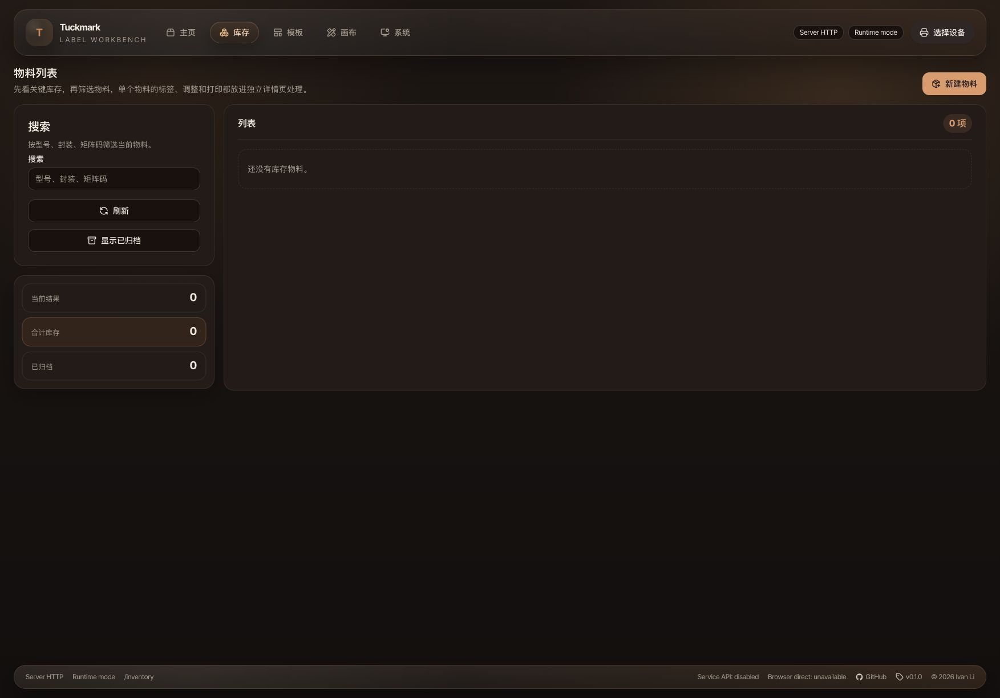

# Tuckmark Inventory and Data-Directory Mainline

- Spec ID: `in7xq`
- Status: `active`
- Owner: `Codex`

## Summary

Tuckmark keeps browser-static user templates and inventory local to the browser.
In `server-http`, DEVD owns the configured data directory and is the sole
business-data authority. Web uses HTTP resource commands; CLI and installed
native tools use named IPC instances. It does not define a separate "shared
template" category: user templates remain the same "我的模板" records.

This round also introduces `/inventory` as a top-level workbench route and
`plugins/inventory` as the shared domain boundary for material records, stock
adjustments, template bindings, and print-input assembly. Dynamic third-party
plugin discovery remains out of scope; the plugin boundary is modular but
built-in.

## Requirements

### Data-directory contract

- A configured data directory is an optional cross-surface persistence surface
  for:
  - user templates
  - user-template versions and working copies
  - inventory materials
  - inventory adjustments
- The configured directory is a versioned JSON tree rooted at:
  - `manifest.json`
  - `settings/app-settings.json`
  - `templates/<templateId>/template.json`
  - `templates/<templateId>/versions/<versionId>.json`
  - `templates/<templateId>/working-copy.json`
  - `inventory/materials/<materialId>.json`
  - `inventory/adjustments/<adjustmentId>.json`
  - `inventory/transactions/<adjustmentId>.json` only while an adjustment
    transaction awaits recovery
  - `drafts/scratch/<presetId>.json`
  - `drafts/preset-template/<presetId>.json`
  - `backups/manual/*.zip`
  - `backups/protection/*.zip`
- `manifest.json` records schema version, timestamps, source metadata, and
  aggregate counts for the current runtime and inventory snapshot: templates,
  versions, working copies, materials, and adjustments.
- Inventory material and adjustment records are versioned by their own JSON
  schemas under `inventory/`; `/system` runtime ZIP backup, restore, import,
  and export include the inventory snapshot alongside the runtime templates.
- An adjustment first records a recoverable transaction, then writes the
  material cache and audit record. Readers replay pending transactions before
  serving inventory data; system sync, backup, and export also replay them
  before capturing the inventory snapshot.
- Routine runtime-template synchronization preserves the existing
  `inventory/` subtree. Only an explicit attach initialization, archive import,
  backup restore, or data-directory switch replaces that subtree.
- Web `/system` owns optional data-directory attach, switch, migration, backup,
  restore, import, and export flows for the runtime template snapshot.
- Without an attached directory, Web persists user templates and inventory in
  its browser-local runtime storage. Attaching a directory deliberately moves
  the Web persistence surface to that directory for cross-surface access.
- CLI does not resolve or open a data directory. It requires `--instance` or
  `TUCKMARK_DEVD_INSTANCE` and sends data commands through DEVD IPC. Legacy
  `--data-dir`, `--devd-url`, and `TUCKMARK_DEVD_URL` values return a migration
  error without fallback.
- DEVD may expose HTTP and named IPC listeners for the same app. macOS/Linux
  use Unix sockets and Windows uses Named Pipes; instance names are explicit so
  multiple development projects can run concurrently.

### Material and stock contract

- Inventory v1 stores only one total quantity per material.
- Material records include:
  - stable `id`
  - `fullName`
  - optional `primaryName`
  - optional `secondaryName`
  - optional `packageName`
  - optional `description`
  - optional `packagingRemark`
  - optional `matrixCode`
  - `currentQuantity`
  - archive metadata
  - template bindings
- `fullName` is the unique business key.
- Non-empty `matrixCode` values are globally unique.
- `currentQuantity` is a non-negative integer.
- A material can bind to one or more templates. Each binding stores:
  - template source and template identifier
  - default print quantity
  - optional field mapping overrides
- Adjustment records are append-only and include:
  - stable `id`
  - `materialId`
  - `type` as `in`, `out`, or `correction`
  - `quantityDelta` for `in` and `out`
  - `targetQuantity` plus derived delta for `correction`
  - optional note
  - actor / source metadata
  - timestamp
- No operation may drive `currentQuantity` below `0`.
- Materials with adjustment history may be archived but not hard-deleted.
- Materials without adjustment history may be deleted permanently.

### Template source and print contract

- The selectable template pool for inventory workflows is:
  - built-in system templates
  - user templates from the active Web store: browser-local by default, or the
    configured directory when attached
- `/canvas` remains the only WYSIWYG template editor.
- CLI template lifecycle management covers user templates exposed by the
  selected DEVD instance.
- System templates remain read-only in CLI and Web lifecycle operations.
- The legacy flat `templates` CLI command remains as a read-only compatibility
  alias for system templates.
- Inventory manual print lets the user:
  - pick one bound template
  - start from the binding's default quantity and field mapping
  - override the print quantity for the current print action
- The material `quantity` and `currentQuantity` fields always represent total
  inventory. The one-off print quantity only controls dispatched print jobs.
- Binding default print quantity is only a manual-print preset in v1. It does
  not auto-trigger on stock movements.
- Field filling defaults to same-name matching and allows per-binding override
  mappings.
- Inventory manual print is an IPC command handled by DEVD: it resolves the
  binding, compiles the authoritative system or user-template document, and
  controls the printer under the existing server-side print gate. No CLI file
  or HTTP fallback is introduced.

### Web contract

- Header navigation adds a top-level `库存` entry at `/inventory`.
- `/inventory` is route-preloaded the same way as the other formal workbench
  routes.
- The desktop route-owned layout is:
  - left: list
  - center: detail and template bindings
  - right: stock and print
- At `960-1279px`, the material list stays visible and the right side switches
  between `物料与标签` and `库存与打印`.
- `/inventory` supports these owner-facing states:
  - browser-local empty inventory
  - configured but empty inventory
  - material list with stock summary
  - material edit and template binding
  - stock adjustment and manual print
- `/system` copy and semantics describe the configured directory as an
  optional unified data location instead of a backup-only mirror.

### CLI contract

- `config get-data-dir` prints the effective saved default directory.
- `config get-data-dir` and `config set-data-dir` are retained only as migration
  errors; DEVD startup configuration owns the data directory.
- `template` commands cover:
  - `list`
  - `show`
  - `import`
  - `rename`
  - `archive`
  - `restore`
  - `delete`
- `inventory` commands cover:
  - `list`
  - `show`
  - `create`
  - `update`
  - `archive`
  - `restore`
  - `delete`
  - `adjust`
  - `print`
- Template and inventory commands fail with a clear data-directory error
  when no directory can be resolved.
- CLI does not provide canvas editing. It only manages template
  lifecycle, preview/print compilation, and inventory operations.

### Migration and compatibility contract

- Browser-local user-template and inventory data remains the default Web
  persistence surface when no directory is attached.
- Attaching a configured directory can initialize from the current
  browser-local runtime data or import an existing Tuckmark directory.
- Without a configured directory:
  - built-in system templates remain usable
  - Web `/templates` and `/canvas` remain usable through browser-local runtime
    storage
  - existing preview / print flows remain usable
  - Web `/inventory` remains available through browser-local inventory storage
    and must not show a data-directory setup prompt
  - CLI `template` / `inventory` commands stay unavailable until a directory
    is resolved, because the CLI cannot access browser-local storage
- This round does not include:
  - automatic print on stock movement
  - camera scanning or fuzzy matrix-code recognition
  - CSV import/export
  - vendor, location, batch, or serial-number inventory dimensions
  - general plugin discovery and installation

## Acceptance

- With a configured data directory, Web `/templates`, `/canvas`,
  `/inventory`, and CLI `template` / `inventory` commands all read and write
  the same template and material records.
- CLI mutations become visible in Web after refresh, and Web mutations become
  visible to CLI without extra conversion steps.
- Without a configured directory, Web `/templates`, `/canvas`, and
  `/inventory` remain available through browser-local runtime storage. CLI
  `template` / `inventory` commands surface an actionable directory error.
- Material CRUD enforces:
  - unique `fullName`
  - globally unique non-empty `matrixCode`
  - non-negative integer `currentQuantity`
  - optional `packagingRemark`
- Adjustment flows enforce:
  - append-only audit records
  - cache refresh of `currentQuantity`
  - no negative post-adjustment stock
  - `correction` using an absolute target quantity while preserving derived
    delta
- Manual inventory print supports both system-template and user-template
  bindings, starts from saved mapping defaults, and still allows one-off print
  quantity override. A positive manual quantity produces that many print jobs
  or browser-direct packet copies.
- Storybook covers at least:
  - browser-local empty inventory
  - configured empty inventory
  - populated inventory list
  - material edit and template bindings
  - stock adjustment and manual print

## Visual Evidence

- `1753×1225` `/inventory` browser-local empty state. The page has no
  data-directory setup prompt; it keeps search above the compact summary stack
  and the material list in the primary column.

  PR: include
  
