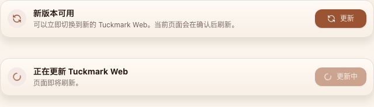
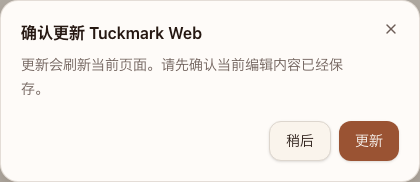
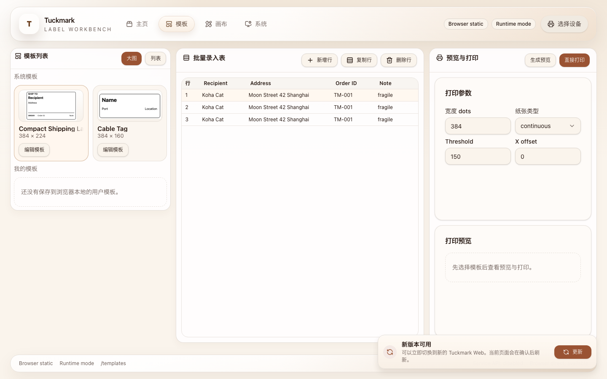
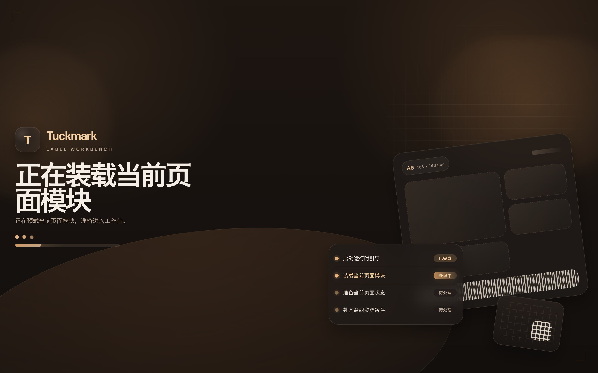
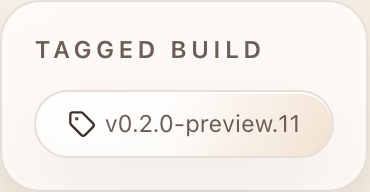

# Tuckmark Bun Pages Release Contract Initialization

- Spec ID: `m2ksq`
- Status: `active`
- Owner: `Codex`

## Summary

Tuckmark must converge on a Bun-first product repository contract with a formal
Web surface, a browser-static owner runtime, a durable PR-label release pipeline,
and a reproducible worktree bootstrap path.

## Requirements

### Product and naming

- Tuckmark is the product contract.
- `detonger` is the lower transport and control layer.
- The formal Web app and the static runtime reuse the same route tree and component
  tree.

### Tooling and bootstrap

- Bun is the primary workspace toolchain.
- Local setup installs hooks, initializes `detonger`, and syncs missing local
  resources.
- Worktree bootstrap must be safe and idempotent.

### Web behavior

- The Web app resolves its mode through an explicit API abstraction.
- Static Pages uses the browser-static runtime with relative asset URLs.
- Static Pages ships a browser-static PWA manifest, maskable icons, and a root
  service worker.
- After the first successful online load, the browser-static runtime must open
  from cached app-shell resources while offline.
- Browser-static updates are non-blocking: a newly detected version caches
  silently in the background, then prompts the user to update only when the
  runtime has confirmed a newer build through either a ready waiting worker or
  a same-origin version probe mismatch.
- Browser-static update checks run immediately on runtime startup, then continue
  at a low-frequency cadence while the page remains open.
- Browser-static cold starts may show a lightweight launch shell from static
  `index.html` while the routed React workbench mounts. This shell must stay
  offline-safe, require no network data, adapt to the active light or dark
  color scheme, and disappear automatically once the app takes over.
- Browser-static startup bootstrap stays thin: the entry script restores SPA
  fallback location, preloads the current route chunk when possible, and
  asynchronously imports the routed runtime instead of synchronously loading
  the full workbench bundle from `index.html`.
- Launch-shell progress communicates real startup tasks only:
  `bootstrap loaded`, `current route chunk ready`, `current route data ready`,
  and `offline warmup started/completed`. It must not imply byte-level network
  download progress.
- Service-worker asset caching is tiered. `install` precaches only `shell` and
  offline-refresh-critical `route` assets, while non-critical `feature` assets
  are warmed silently in the background after the current-route shell is ready.
- If the current tab has gone stale since its last update check, returning the
  page to a visible, focused, or newly online state must trigger a guarded
  catch-up update check without surfacing any extra post-startup loading UI.
- Browser-static builds must publish a same-origin `version.json` metadata probe
  that reflects the current `appVersion` and `buildRef`, bypasses app-shell
  precache, and is fetched with cache-busting semantics so stranded clients can
  detect newer deployments.
- Runtime deployments use either `server-http` or `browser-static` surface.
- `demo=true` enters demo mode, `demo=false` and no param stay on runtime mode.

### Delivery

- PR labels are the release-intent source of truth.
- Mainline release uses a durable snapshot and supports backfill.
- Pages deployment is separate from GitHub Release publication.
- Published GitHub Releases and automated release publication trigger a fresh
  Pages deployment with release tag metadata so the browser-static footer shows
  the published release version while the build reference remains available in
  tooltip metadata.
- Untagged mainline Pages deploys must expose `build <shortsha>` only instead
  of reusing stale package or release version text.
- Repository settings must align with repo-local declarations.

## Acceptance

- `bun run setup` succeeds from a fresh linked worktree.
- required checks match `.github/quality-gates.json`
- Pages serves the formal app from the root path with relative assets
- Browser-static PWA install metadata is complete enough for browser-native
  installation.
- Browser-static builds ship an owner-facing launch shell in `index.html` so
  installed-PWA cold starts do not expose a blank body before JavaScript boot.
- The browser-static launch shell stays legible and branded in both light and
  dark color schemes.
- Installed-PWA startup reaches a navigable current-route shell before
  background hydration and feature warmup finish.
- The owner-facing launch shell progress rail reflects startup task completion
  rather than fixed placeholder percentages or download-byte promises.
- Service-worker `install` precache is limited to `shell` and `route` assets;
  `feature` assets are cached later through silent warmup.
- Offline refresh still works for `/`, `/templates`, `/canvas`, and `/system`
  after a first successful online load and automatic background warmup.
- New-version caching is silent; the update prompt appears only after the
  runtime confirms a newer build through a waiting worker or version-probe
  mismatch.
- Long-lived browser-static tabs continue to recheck for new versions at a low
  frequency, while stale or stranded tabs catch up when the page becomes
  active, focused, or returns online.
- `version.json` stays aligned with the active Pages build metadata and is not
  precached by the service worker.
- Release can publish stable and preview bundles from durable snapshots
- Pages redeploys after release publication display the published release tag
  in footer metadata and expose `build <shortsha>` via tooltip
- Untagged `main` Pages deploys display `build <shortsha>` only in footer
  metadata
- GitHub labels, protection, and Pages settings align with repository truth

## Visual Evidence

This spec requires deterministic evidence from repo-owned surfaces:

- static build inspection proving root-path relative asset URLs
- static build inspection proving PWA manifest, icons, service worker, and
  tiered install precache plus background warmup entries
- Playwright coverage for service worker registration and offline deep-link
  refresh after first load
- Storybook coverage for PWA update prompt component states
- Storybook coverage for the browser-static launch shell state

Non-deterministic screenshots from a live browser window do not count as proof for
this spec.

The prompt state gallery is captured from Storybook canvas using mock state only.
It covers all owner-facing prompt states: waiting-worker ready, stranded-client
version-probe mismatch ready, and activation in progress. Background caching
remains intentionally silent and has no visible prompt state.

PR: include

The ready-to-update action opens a project-owned confirmation dialog before
refreshing the page. The dialog replaces browser-native `confirm` behavior while
preserving the user-confirmed refresh contract.

The owner-facing placement evidence is produced from a repo-owned Storybook
workbench-shell fallback with the update lifecycle mocked to the stranded-client
version-probe mismatch state. It verifies the prompt location against the
complete routed workbench shell without depending on a live deployment or an
already-installed browser shell.

PR: include

The cold-start launch shell evidence is captured from a repo-owned mock render
that mirrors the static entry HTML, while the same state also keeps Storybook
coverage for ongoing review. The shell intentionally communicates startup
progress without blocking or replacing the later non-blocking update prompt
contract. Its checklist and progress rail reflect startup task phases, not
byte-level network download progress.

PR: include

PR: include

The footer build-metadata contract is captured from Storybook canvas so release
and untagged states can be reviewed without relying on a live deployment.
Tagged builds keep the published release version visible while exposing the
exact build reference in tooltip metadata for operator support.

PR: include

Hovering the tagged footer metadata reveals the build reference without turning
it into always-visible footer text.

PR: include

Untagged mainline builds do not masquerade as a release. They expose only the
current `build <shortsha>` marker in the owner-facing footer.

PR: include

