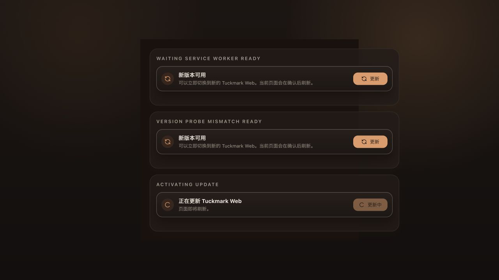
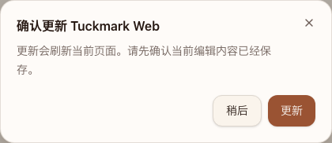
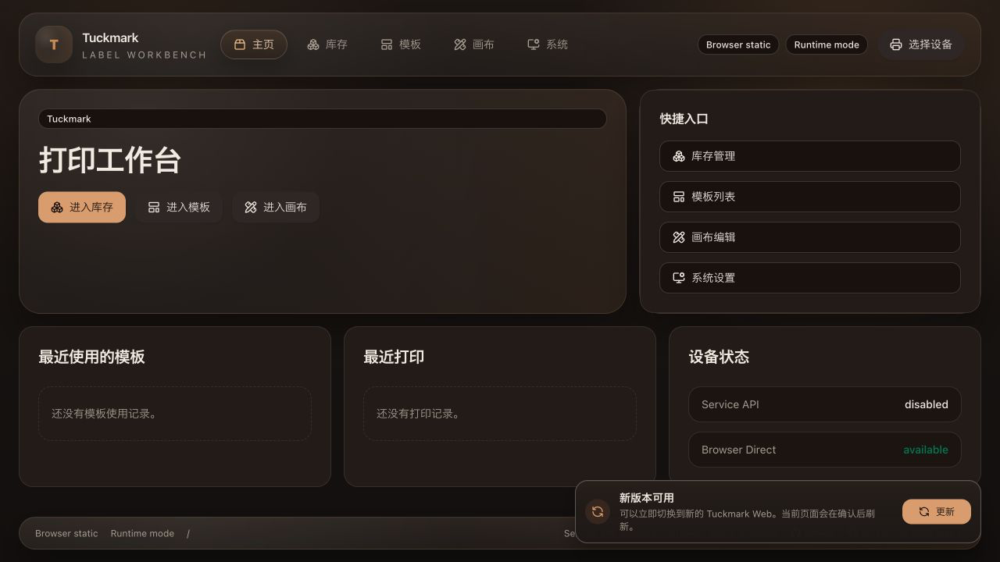
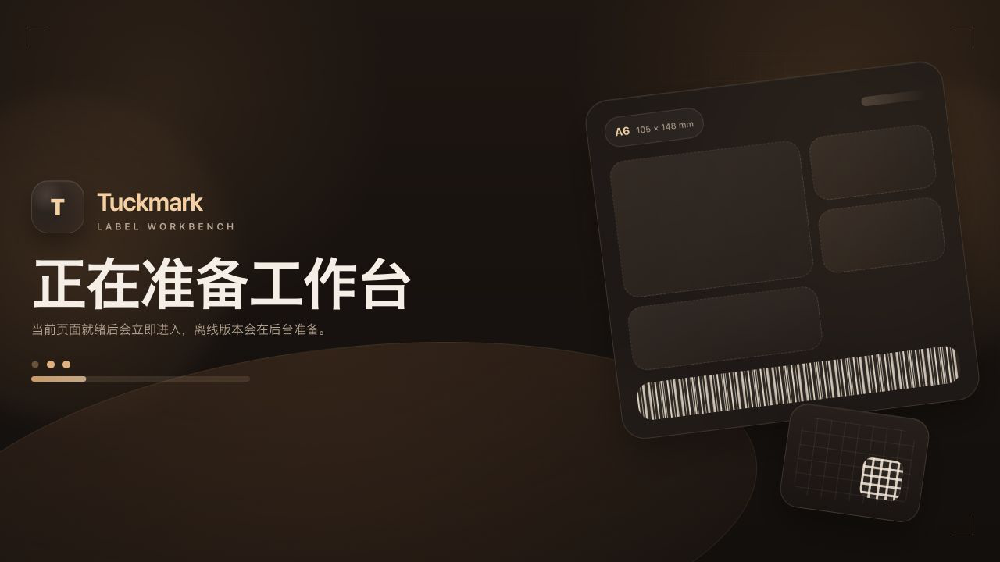
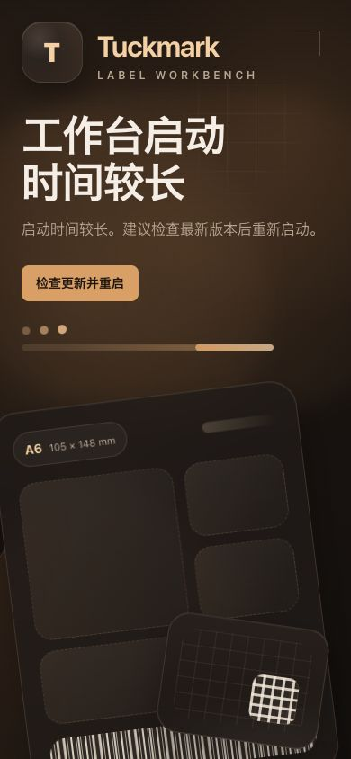
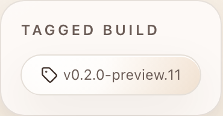

# Tuckmark Bun Pages Release Contract Initialization

- Spec ID: `m2ksq`
- Status: `active`
- Owner: `Codex`

## Summary

Tuckmark must converge on a Bun-first product repository contract with a formal
Web surface, a browser-static owner runtime, a durable PR-label release pipeline,
and a reproducible worktree bootstrap path.

## Requirements

### Product and naming

- Tuckmark is the product contract.
- `detonger` is the lower transport and control layer.
- The formal Web app and the static runtime reuse the same route tree and component
  tree.

### Tooling and bootstrap

- Bun is the primary workspace toolchain.
- Local setup installs hooks, initializes `detonger`, and syncs missing local
  resources.
- Worktree bootstrap must be safe and idempotent.

### Web behavior

- The Web app resolves its mode through an explicit API abstraction.
- Static Pages uses the browser-static runtime with relative asset URLs.
- Static Pages ships a browser-static PWA manifest, maskable icons, and a root
  service worker.
- Offline navigation is eligible only after a browser-static worker has cached
  every executable static asset, HTML entry, manifest, and icon and then written
  its version-ready marker. A partial cache must never answer navigation or
  asset requests.
- The PWA manifest declares separate standard `any` and safe-zone `maskable`
  icons, while entry HTML provides SVG/PNG/ICO favicon fallbacks and the Apple
  Touch icon sizes required by installed browser surfaces.
- After the first successful online load, the browser-static runtime must open
  from cached app-shell resources while offline.
- Browser-static updates are non-blocking: a newly detected version caches
  silently in the background, then prompts the user to update only when the
  runtime has confirmed a newer build through either a ready waiting worker or
  a same-origin version probe mismatch.
- Browser-static update checks run immediately on runtime startup, then continue
  at a low-frequency cadence while the page remains open.
- Browser-static cold starts may show a lightweight launch shell from static
  `index.html` while the routed React workbench mounts. This shell must stay
  offline-safe, require no network data, adapt to the active light or dark
  color scheme, and disappear automatically once the app takes over.
- The static launch shell registers the PWA before React boot and reports mount
  success or bootstrap failure. After 10 seconds it offers a non-blocking
  update-and-restart suggestion; after 60 seconds it exposes terminal recovery
  actions. Startup never clears caches, activates a waiting worker, or reloads
  automatically, and it never clears browser user data.
- Browser-static startup bootstrap stays thin: the entry script restores SPA
  fallback location, preloads the current route chunk when possible, and
  asynchronously imports the routed runtime instead of synchronously loading
  the full workbench bundle from `index.html`.
- Launch-shell state is driven by real startup milestones, but the
  owner-facing shell stays coarse: it must not enumerate internal parallel
  task names or imply byte-level network download progress.
- Service-worker installation is an all-or-nothing offline-version transaction:
  it precaches the complete static application and writes the readiness marker
  only after every request succeeds. `sw.js` and `version.json` remain outside
  that version cache so browser update checks and metadata probing stay current.
- Once the current-route shell is visible, browser-static must warm the
  remaining route chunks in the background so ordinary in-app page switches do
  not reopen the owner-facing startup shell.
- If a deferred route chunk is still racing the first navigation, any loading
  affordance must stay route-local and lightweight instead of presenting a
  second startup-like screen.
- Owner-initiated in-app route switches should update the browser location
  immediately, keep the mounted current page visible during any hold/pending
  window, and reveal the new routed content only after the target route is
  ready enough to cross its reveal gate.
- If the current tab has gone stale since its last update check, returning the
  page to a visible, focused, or newly online state must trigger a guarded
  catch-up update check without surfacing any extra post-startup loading UI.
- Browser-static builds must publish a same-origin `version.json` metadata probe
  that reflects the current `appVersion` and `buildRef`, bypasses app-shell
  precache, and is fetched with cache-busting semantics so stranded clients can
  detect newer deployments.
- Runtime deployments use either `server-http` or `browser-static` surface.
- `demo=true` enters demo mode, `demo=false` and no param stay on runtime mode.

### Delivery

- PR labels are the release-intent source of truth.
- Mainline release uses a durable host-tools snapshot and supports backfill
  within that host-tools release contract.
- Published GitHub Releases must include human-readable release notes generated
  from the verified release snapshot and merged PR metadata.
- Published GitHub Releases contain only four platform-native host-tools
  archives and `SHA256SUMS`. Each archive provides standalone `tuckmark` and
  `tuckmark-devd` executables, private detonger helpers, and the released Agent
  Skills without requiring Node, Bun, Cargo, `node_modules`, or a source
  checkout at runtime. Both public executable version commands identify the
  release version, complete merge SHA, and target triple.
- Release installation is manual and documented. Tuckmark does not ship an
  installer script or change PATH settings.
- Releasable snapshots fail publication before `gh release create` when PR
  context is missing or the generated release notes do not satisfy the required
  `Included Change`, `Release Metadata`, and `Bundles` sections.
- Release publication emits a `release-context-<merge_sha>` artifact containing
  `release-context.json` and `release-notes.md` for failure analysis and
  rerun context.
- Pages deployment is separate from GitHub Release publication.
- Published GitHub Releases and automated release publication trigger a fresh
  Pages deployment with release tag metadata so the browser-static footer shows
  the published release version while the build reference remains available in
  tooltip metadata and the visible release tag deep-links into the repository's
  OctoRill public releases list with that tag highlighted.
- Untagged mainline Pages deploys must expose `build <shortsha>` only instead
  of reusing stale package or release version text.
- Repository settings must align with repo-local declarations.

## Acceptance

- `bun run setup` succeeds from a fresh linked worktree.
- required checks match `.github/quality-gates.json`
- Pages serves the formal app from the root path with relative assets
- Browser-static PWA install metadata is complete enough for browser-native
  installation.
- Browser-static builds ship an owner-facing launch shell in `index.html` so
  installed-PWA cold starts do not expose a blank body before JavaScript boot.
- While that launch shell is visible, the routed runtime shell must remain
  hidden instead of peeking through underneath the startup surface.
- The browser-static launch shell stays legible and branded in both light and
  dark color schemes.
- Installed-PWA startup reaches a navigable current-route shell before
  background hydration and offline-readiness confirmation finish.
- The owner-facing launch shell uses generic branded startup copy and an
  indeterminate progress rail while startup is pending; it does not expose
  internal task names, auxiliary explanatory cards, or byte-level download
  promises.
- Service-worker `install` succeeds only after the complete browser-static
  application cache has been written and marked ready; failed or unmarked
  versions cannot serve offline navigation.
- Ordinary page switches inside the mounted workbench do not reopen the
  owner-facing launch shell; after shell-ready they should resolve from warmed
  route chunks, with at most a local route placeholder if prefetch loses a
  race.
- While a deferred route chunk is still racing, the browser location should
  already reflect the intended destination even if the previous page is still
  being held on screen.
- Offline refresh works for `/`, `/templates`, `/canvas`, and `/system` after
  a complete online version has been cached.
- After 10 seconds without a mounted workbench, the launch shell shows a
  non-blocking slow-start message and offers an owner-triggered update check
  and restart. When a complete waiting worker is present, that action can use
  the newer version explicitly.
- Dynamic-import failure, synchronous mount failure, and 60-second no-mount
  timeout leave the launch shell with actionable recovery controls rather than
  an indefinite loading screen. The startup task does not automatically clear
  caches, unregister workers, activate a waiting worker, or reload the page.
- New-version caching is silent; the update prompt appears only after the
  runtime confirms a newer build through a waiting worker or version-probe
  mismatch.
- Long-lived browser-static tabs continue to recheck for new versions at a low
  frequency, while stale or stranded tabs catch up when the page becomes
  active, focused, or returns online.
- `version.json` stays aligned with the active Pages build metadata and is not
  precached by the service worker.
- Release can publish stable and preview host-tools archives from durable snapshots
- Release notes show the merged PR title/link, release type/channel, merge SHA,
  and published bundles instead of a one-line placeholder body
- Pages redeploys after release publication display the published release tag
  in clickable footer metadata, open the repository's OctoRill public releases
  list with that tag highlighted, and expose `build <shortsha>` via tooltip
- Untagged `main` Pages deploys display `build <shortsha>` only in footer
  metadata
- GitHub labels, protection, and Pages settings align with repository truth

## Visual Evidence

This spec requires deterministic evidence from repo-owned surfaces:

- static build inspection proving root-path relative asset URLs
- static build inspection proving PWA manifest, icons, complete-version service
  worker precache, readiness marker, and `version.json` exclusion
- Playwright coverage for service worker registration and offline deep-link
  refresh after first load
- Storybook coverage for PWA update prompt component states
- Storybook coverage for the browser-static launch shell state

Non-deterministic screenshots from a live browser window do not count as proof for
this spec.

### PWA Evidence Matrix

| Acceptance contract | Owner-facing visual evidence | Behavioral verification |
| --- | --- | --- |
| Cold launch remains branded without blocking the current route | `pwa-launch-splash-state.png`, `pwa-launch-splash-dark-state.png` | Browser-static launch test reaches the routed workbench after the shell appears. |
| A delayed launch gives a bounded 10-second update suggestion on mobile | `pwa-launch-slow-start-state.png` | Launch-recovery Playwright test advances the slow-start timer and asserts the update action. |
| A one-minute failed launch is terminal and owner-actionable | `pwa-launch-recovery-state.png` | Launch-recovery Playwright test asserts both reload and update-restart actions without an automatic cache clear or reload. |
| Ordinary updates remain explicit and non-blocking | `pwa-update-toast-state-gallery.png`, `pwa-workbench-update-toast-viewport.png` | Story interactions cover update confirmation; runtime tests cover waiting-worker and version-probe paths. |
| Offline entry is an atomic complete-version contract | Not user-visible by design: readiness must stay silent until the workbench is usable. | Browser-static Playwright verifies the ready marker, then offline refresh for `/`, `/templates`, `/canvas`, and `/system`; static-build inspection verifies complete precache and excludes `WARM_ASSETS`. |

The prompt state gallery is captured from Storybook canvas using mock state only.
It covers all owner-facing prompt states: waiting-worker ready, stranded-client
version-probe mismatch ready, and activation in progress. Background caching
remains intentionally silent and has no visible prompt state.

PR: include

The ready-to-update action opens a project-owned confirmation dialog before
refreshing the page. The dialog replaces browser-native `confirm` behavior while
preserving the user-confirmed refresh contract.

The owner-facing placement evidence is produced from a repo-owned Storybook
workbench-shell fallback with the update lifecycle mocked to the stranded-client
version-probe mismatch state. It verifies the prompt location against the
complete routed workbench shell without depending on a live deployment or an
already-installed browser shell.

PR: include

The cold-start launch shell evidence is captured from a repo-owned mock render
that mirrors the static entry HTML, while the same state also keeps Storybook
coverage for ongoing review. The shell intentionally communicates branded
startup readiness without blocking or replacing the later non-blocking update
prompt contract. Its copy stays coarse and its progress rail stays
indeterminate so installed-PWA startup does not pretend internally parallel
work is a linear checklist or a byte-level network download.

PR: include

PR: include

The launch recovery states are deterministic Storybook canvas renderings with
mock-only inputs. They verify the 10-second slow-start update suggestion and
the one-minute terminal state, each with explicit owner-controlled restart
actions instead of an endless startup rail or automatic recovery. The
slow-start story binds a mobile viewport and keeps its title as the semantic
groups "工作台启动 / 时间较长" rather than allowing a character-level wrap;
both the static shell and React shell use a 1.12 title line-height so the two
semantic lines remain readable across mobile and desktop states.

PR: include

PR: include

The footer build-metadata contract is captured from Storybook canvas so release
and untagged states can be reviewed without relying on a live deployment.
Tagged builds keep the published release version visible while exposing the
exact build reference in tooltip metadata for operator support and routing the
visible tag into the repository's OctoRill release list.

PR: include

Hovering or focusing the tagged footer metadata reveals the build reference
without turning it into always-visible footer text.

PR: include

Untagged mainline builds do not masquerade as a release. They expose only the
current `build <shortsha>` marker in the owner-facing footer.

PR: include

