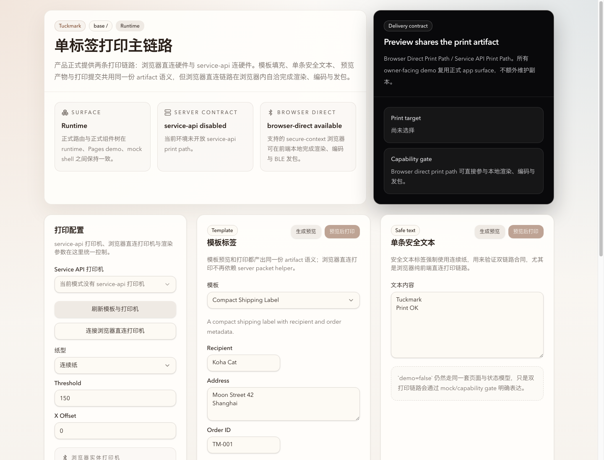

# Tuckmark Dual Print Path Capability and Readiness Contract

- Spec ID: `np55v`
- Status: `active`
- Owner: `Codex`

## Summary

Tuckmark Web exposes two formal print paths: `browser-direct print path` and
`service-api print path`.

The browser-direct path must remain a pure-browser solution that renders,
encodes, and sends print payloads without relying on runtime server packet
helpers. The service-api path remains a separate runtime path with explicit
startup readiness enforcement.

## Requirements

### Product contract

- The Web product exposes two independent print-path switches:
  - `TUCKMARK_ENABLE_BROWSER_DIRECT_PRINT`
  - `TUCKMARK_ENABLE_SERVER_SIDE_PRINT`
- Owner-facing capability state is expressed as the state of those two print
  paths, not as transport implementation details.
- The shared state vocabulary is:
  - `available`
  - `disabled`
  - `mocked`
  - `unsupported`
  - `unavailable`

### Browser-direct print path

- When `TUCKMARK_ENABLE_BROWSER_DIRECT_PRINT=1`, the browser-direct print path
  is part of the formal product surface.
- The browser-direct path must not depend on `/api/artifacts/:id/packets` or any
  runtime packet/render helper.
- The browser-direct path may reuse the shared artifact model, but it must be
  able to materialize printable payloads in the browser from the current input.
- Unsupported browsers or insecure contexts surface as `unsupported`, not as a
  server dependency failure.

### Service-api print path

- When `TUCKMARK_ENABLE_SERVER_SIDE_PRINT=1`, the runtime must validate detonger
  readiness before starting the HTTP server.
- Missing detonger/runtime prerequisites are a startup-fatal condition for the
  service-api path.
- Disabling the service-api path must not break Web preview or the
  browser-direct path.

### Demo and mock contract

- Pages demo and mock shell reuse the same Web app and state model.
- Non-runtime demo surfaces may report `service-api print path` as `mocked`.
- Browser-direct print path remains a formal path even in demo surfaces when the
  browser supports Web Bluetooth.

## Acceptance

- `browser-direct=on` and `service-api=off` still allow the Web app to build,
  start, preview, and submit browser-direct print jobs without `/api` packet
  helpers.
- `browser-direct=off` and `service-api=on` disable browser-direct printing
  while preserving service-api startup gating.
- `browser-direct=on` in an unsupported browser reports `unsupported`, not a
  service startup failure.
- Product docs, runtime contracts, Storybook/demo state, and UI copy all use
  the same dual-path terminology.

## Visual Evidence

