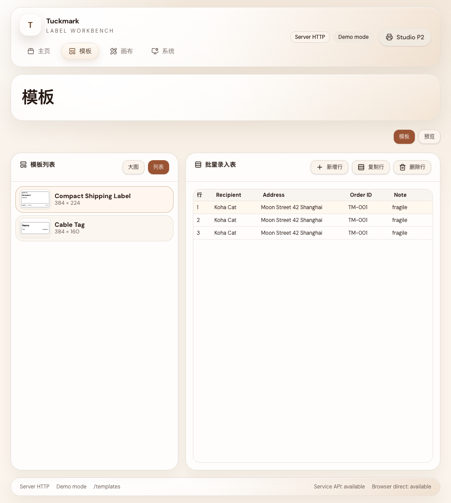
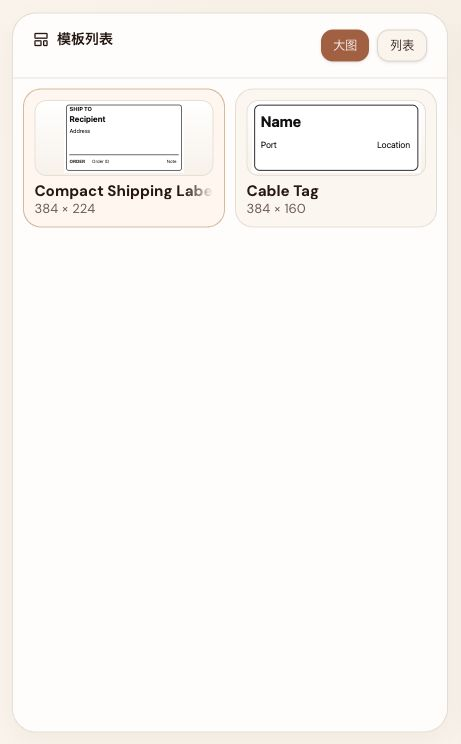
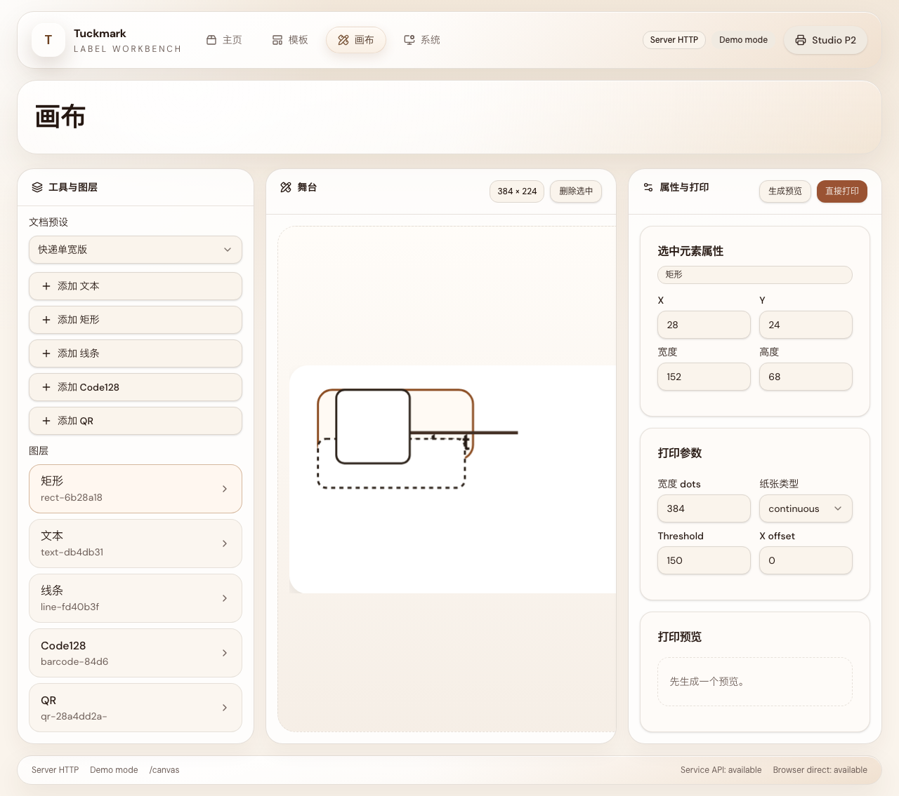

# Tuckmark Workbench and Freeform Canvas

- Spec ID: `tk8wb`
- Status: `active`
- Owner: `Codex`

## Summary

Tuckmark Web is a four-page desktop workbench with a shared artifact seam.

The canonical route tree is `/`, `/templates`, `/canvas`, and `/system`. The
shell uses a top-middle-bottom layout with a shared header, shared footer, and
one right-side device drawer across `server-http`, `browser-static`, and
`demo`.

The `templates` and `canvas` routes are formal three-panel workspaces. At
`1024-1279px`, they switch into `focus-paired dual-pane` mode and keep the
center workspace visible while swapping the active side pair based on user
focus.

The freeform canvas uses `react-konva` for editing only. Preview and print
continue to normalize back into the shared canvas schema and the existing
artifact pipeline.

## Requirements

### Route and shell contract

- The canonical route tree is:
  - `/`
  - `/templates`
  - `/canvas`
  - `/system`
- The shell layout is:
  - top: `AppHeader`
  - middle: routed content outlet
  - bottom: `StatusFooter`
- `AppHeader` contains:
  - left: product mark and primary navigation
  - right: device entry button
- The device entry button opens a right-side `device drawer`.
- `browser-static`, `server-http`, and `demo` reuse the same route tree and the
  same page components.
- Static Pages keeps browser history routing semantics and ships a `404.html`
  SPA fallback. Hash routing is not allowed.

### Visual direction

- The shell, overview cards, drawer, and primary actions use the restrained
  clay surface language.
- Dense work areas such as tables, property panels, and print rails keep a
  restrained professional tool appearance with stronger information density and
  lower decorative noise.
- Typography contract:
  - brand and large titles: `Nunito`
  - body, controls, tables, and property panels: `DM Sans`
- The desktop support range is:
  - width: `1024-1920`
  - height: `720-1280`
- Benchmark viewports:
  - `1024×768`
  - `1280×800`
  - `1440×900`
  - `1600×1024`

### Workspace contract

- `templates` workspace layout:
  - left: template list and template notes
  - center: multi-row batch-entry table
  - right: preview, print parameters, and print actions
- `canvas` workspace layout:
  - left: tools, document presets, and layers
  - center: editable stage
  - right: selection properties, print parameters, preview, and print actions
- `system` page contains:
  - app settings
  - default print settings
  - device management and probe actions
- `home` page contains:
  - recent templates
  - recent prints
  - quick entry points to template and canvas workspaces

### Focus-paired dual-pane contract

- At `>=1280px`, template and canvas workspaces remain three-column layouts.
- At `1024-1279px`, template and canvas workspaces enter `focus-paired
  dual-pane`.
- `focus-paired dual-pane` rules:
  - the center workspace remains visible at all times
  - only one side pair is expanded at a time
  - the hidden side collapses to a `44-48px` edge rail with icon and label
- Template workspace switching:
  - template selection or data-table editing shows `left + center`
  - preview, print settings, or print action focus shows `center + right`
- Canvas workspace switching:
  - tool, preset, or layer focus shows `left + center`
  - property, preview, or print focus shows `center + right`
  - stage dragging, panning, and zooming must not trigger focus switching
- No manual lock or user override state is introduced in v1.

### Canvas and artifact seam contract

- The freeform editor uses `react-konva + konva` for interaction only.
- Shared printable canvas schema supports:
  - `text`
  - `rect`
  - `line`
  - `barcode`
  - `qr`
- Barcode scope in v1:
  - only `Code128`
  - generated through `JsBarcode`
- QR scope in v1:
  - generated through `qrcode`
- Preview and print normalize editor state into `DirectCanvasDefinition` and
  then flow through shared renderer, preview, and print seams.
- `browser-static` must support canvas preview and print without `/api` packet
  helpers.

### Recent activity and persistence contract

- Recent templates and recent prints are stored browser-locally.
- The browser-local registry uses `localStorage` metadata and may enrich itself
  from the current browser artifact store.
- No remote history service or `/api/history` endpoint is introduced.

## Acceptance

- All four formal routes are reachable in `runtime`, `demo`, and
  `browser-static`.
- The device drawer opens from any page, supports keyboard close, and restores
  focus to the trigger.
- `browser-static` supports deep-link refresh through `404.html`.
- Template workspace supports `0`, `1`, and `20` rows without layout breakage.
- Canvas workspace supports create, select, move, resize, and delete for
  `text`, `rect`, `line`, `barcode`, and `qr`.
- Invalid barcode or QR payloads surface as user-visible errors.
- `1024×768` enters `focus-paired dual-pane`.
- `1280×800`, `1440×900`, and `1600×1024` remain stable three-column layouts
  without horizontal overflow.

## Visual Evidence

- `1440×900` homepage shell

  

- `1024×768` template workspace in list mode

  

- `1280×800` template large-card grid remains two-up inside the left workspace pane

  

- `1280×800` canvas workspace in compact three-column mode

  

- `1600×1024` system page in wide three-column mode

  
