# Tuckmark Workbench and Freeform Canvas

- Spec ID: `tk8wb`
- Status: `active`
- Owner: `Codex`

## Summary

Tuckmark Web is a four-page desktop workbench with a shared artifact seam.

The canonical route tree is `/`, `/templates`, `/canvas`, and `/system`. The
shell uses a top-middle-bottom layout with a shared header, shared footer, and
one right-side device drawer across `server-http`, `browser-static`, and
`demo`.

The `templates` and `canvas` routes are formal workspaces that preserve the
shared shell while specializing their inner tool surfaces. `templates` keeps
its route-owned narrow fallback. `/canvas` is now an editor-first label tool
with a stable three-column desktop layout and a route-local narrow desktop
mode that keeps the stage visible while switching one contextual side rail.

The freeform canvas uses `react-konva` for interactive editing only. Preview
and print continue to normalize back into the shared canvas schema and the
existing artifact pipeline through `toCanvasPrintSource`.

The stage now separates three layers explicitly:

- a white label-paper base
- a non-printing editor grid above the paper
- printable SVG content above the grid

This keeps label boundaries readable inside the editor while preserving visible
grid guidance and a single shared content truth between stage preview and final
output.

## Requirements

### Route and shell contract

- The canonical route tree is:
  - `/`
  - `/templates`
  - `/canvas`
  - `/system`
- The shell layout is:
  - top: `AppHeader`
  - middle: routed content outlet
  - bottom: `StatusFooter`
- `AppHeader` contains:
  - left: product mark and primary navigation
  - right: device entry button
- The device entry button opens a right-side `device drawer`.
- `browser-static`, `server-http`, and `demo` reuse the same route tree and the
  same page components.
- Static Pages keeps browser history routing semantics and ships a `404.html`
  SPA fallback. Hash routing is not allowed.

### Visual direction

- The shell, overview cards, drawer, and primary actions use the restrained
  clay surface language.
- Dense work areas such as tables, property panels, and print rails keep a
  restrained professional tool appearance with stronger information density and
  lower decorative noise.
- Typography contract:
  - brand and large titles: `Nunito`
  - body, controls, tables, and property panels: `DM Sans`
- The desktop support range is:
  - width: `1024-1920`
  - height: `720-1280`
- Benchmark viewports:
  - `1024×768`
  - `1280×800`
  - `1440×900`
  - `1600×1024`

### Workspace contract

- `templates` workspace layout:
  - left: weak-grouped system templates and browser-local user templates
  - center: multi-row batch-entry table
  - right: preview, print parameters, and print actions
- `canvas` workspace layout:
  - left: document presets, quick-add actions, and layer management
  - center: stage, editor toolbar, zoom state, and stage hints
  - right: `属性 / 输出` inspector with explicit tab switching
  - version history opens from the save-action area into a right-side drawer
- `system` page contains:
  - app settings
  - default print settings
  - device management and probe actions
- `home` page contains:
  - recent templates
  - recent prints
  - quick entry points to template and canvas workspaces

### Responsive workspace contract

- At `>=1280px`, template and canvas workspaces remain three-column layouts.
- At `>=1280px`, template workspace keeps the left template rail wide enough to
  preserve a readable two-up large-card grid instead of collapsing card width
  as a side effect of the three-pane shell.
- Template workspace keeps its existing route-owned narrow behavior.
- Canvas workspace does not reuse template-style `focus-paired dual-pane`.
  Instead it uses a route-local narrow desktop editor mode.
- Template workspace switches to a route-owned narrow fallback:
  - at `960-1279px`, the list stage shows `template list + disabled
    preview/print rail`; selecting a template swaps the left pane into the
    batch table while keeping the right preview/print rail visible and
    interactive, and the table view exposes an explicit return action back to
    the template list
  - below `960px`, preview and print move below the batch table instead of
    remaining in a side rail
- Canvas narrow desktop rules:
  - active range is `960-1279px`
  - the center stage stays visible at all times
  - the user explicitly switches between `工具与图层` and `属性与输出`
  - the inactive side rail is fully hidden instead of collapsing to decorative
    micro-rails
  - below `960px`, `/canvas` is outside the first-pass professional editor
    support target

### Canvas and artifact seam contract

- The freeform editor uses `react-konva + konva` for interaction only.
- Shared printable canvas schema supports:
  - `text`
  - `rect`
  - `line`
  - `barcode`
  - `qr`
- Barcode scope in v1:
  - only `Code128`
  - generated through `JsBarcode`
- QR scope in v1:
  - generated through `qrcode`
- Stage rendering uses the same barcode / QR semantic inputs as preview and
  print. Barcode and QR elements must render as real encoded graphics inside
  the editor instead of placeholder boxes.
- Invalid barcode / QR content must degrade safely inside the editor:
  - the stage shows a clear invalid-state placeholder instead of crashing
  - the inspector explains the issue in plain language
  - preview / direct print actions stay blocked until the issue is resolved
- Canvas content is monochrome-only. Editor selection chrome may use product
  accent colors, but printable label elements themselves render only in black
  and white and do not expose color editing.
- Shared schema extensions:
  - `rotation` is supported on `text`, `rect`, `barcode`, and `qr`
  - `line` keeps endpoint-based geometry and does not add rotation as a first
    class print contract
- Preview and print normalize editor state into `DirectCanvasDefinition` and
  then flow through shared renderer, preview, and print seams.
- Rotated multiline text in preview and print must rotate around the rendered
  text box center so output stays aligned with the stage editing bounds.
- `browser-static` must support canvas preview and print without `/api` packet
  helpers.

### Canvas interaction and draft contract

- The editor state is versioned as a Web draft document with:
  - document metadata
  - per-layer metadata (`name`, `visible`, `locked`)
  - editor metadata (`gridEnabled`, `snapEnabled`)
- Scratch-draft persistence uses preset-scoped browser storage keys and also
  participates in same-device sync with `TuckmarkService` when the
  `server-http` surface is live.
- Browser-local user templates use an IndexedDB-backed registry with a memory
  fallback in nonconforming environments.
- Refresh restores the latest working copy for the active document source.
- Resetting a scratch draft clears the stored scratch working copy for that
  preset, records a sync tombstone, and rebuilds from the built-in preset.
- Resetting a preset-template draft rebuilds from the system template source.
- Resetting a user-template draft restores the current saved version of that
  browser-local template.
- Undo / redo keeps an in-memory history stack capped at `50` snapshots and
  does not restore history across refreshes.
- Canvas interaction baseline:
  - single selection
  - Shift multi-selection
  - marquee selection
  - drag move
  - wheel zoom relative to pointer
  - `Space + drag` stage pan
  - `fit to view`
  - transformer-based resize / rotation
  - `Delete`, `Duplicate`, `Undo`, `Redo`, and `Escape`
- Text elements support double-click inline editing on the stage.
- Layer rail supports:
  - rename
  - reorder
  - lock / unlock
  - show / hide
  - duplicate
  - delete
- Multi-select inspector behavior:
  - zero selection shows a focused onboarding hint
  - multi-selection shows batch actions and does not silently edit the first
    selected element as if it were a single-selection state
- Workbench selectable contract:
  - shared shell chrome, workspace chrome, static notices, and list-card
    metadata are non-selectable by default
  - editable fields, textareas, inline text editing, and structured table
    inputs preserve normal text selection and editing behavior
  - copy-relevant read-only values such as canvas size, zoom value, selection
    status, and layer names remain selectable through explicit read-only field
    surfaces instead of plain static text
  - canvas drag, marquee select, pan, zoom, and layer switching must not leave
    behind stray browser text-highlight artifacts

### Recent activity and persistence contract

- Recent templates and recent prints are persisted in a shared same-device sync
  state that merges browser-local storage with `TuckmarkService`.
- The browser snapshot remains the first-write surface and is reconciled with
  the service snapshot during startup and after key mutations.
- No remote history service or `/api/history` endpoint is introduced.
- Scratch canvas drafts participate in the same same-device sync state. No
  cross-device account sync or remote document service is introduced.
- Browser-local user templates, saved versions, autosaves, and user-template
  working copies stay browser-local only and do not sync through the service.
- Browser-local user template persistence contract:
  - source kinds are `scratch`, `preset-template`, and `user-template`
  - first save from `scratch` or `preset-template` creates a browser-local user
    template and its first saved version
  - save on a connected user template appends a new saved version
  - save as creates a new browser-local template from the current draft or
    read-only version and does not inherit the source template's history
  - saved versions retain the most recent `20`
  - autosaved unsaved versions retain the most recent `10`
  - autosave rolls every `5` minutes for named browser-local templates
- Browser-local user template field contract:
  - only `text`, `barcode`, and `qr` can bind to structured replacement fields
  - field identity is a stable `key`; layer names remain editor-facing labels
  - multiple elements may share one field binding
  - rebinding to an existing field immediately syncs the element value to that
    field default value
  - v1 field metadata is limited to `label`, `key`, `defaultValue`,
    `multiline`, and the current binding list
  - replaceable-element editing only exposes one field-name input with
    autocomplete and dropdown selection over existing fields; it does not add a
    second binding selector
- Template list contract:
  - `/templates` groups cards into `系统模板` and `我的模板`
  - clicking a system-template card enters the structured print-entry flow
  - clicking a browser-local user-template card enters the structured
    print-entry flow
  - both groups keep an explicit `编辑模板` route into `/canvas`
  - browser-local user template rows compile client-side into a concrete canvas
    definition before preview or print, so `browser-static` and `server-http`
    reuse the existing canvas artifact seam without a new template persistence
    API
- Canvas editor contract:
  - system template elements with fixed keys such as `__title` stay static when
    imported into the editor
  - the toolbar save-action cluster exposes a `版本历史` entry that opens a
    right-side drawer
  - the version-history drawer lists saved versions and a collapsed autosave
    section
  - opening a historical version makes the stage read-only
  - read-only historical mode only exposes `恢复`, `另存为`, and `返回当前草稿`
  - restoring a historical version creates a new current working copy instead
    of mutating saved history in place

## Acceptance

- All four formal routes are reachable in `runtime`, `demo`, and
  `browser-static`.
- The device drawer opens from any page, supports keyboard close, and restores
  focus to the trigger.
- `browser-static` supports deep-link refresh through `404.html`.
- Template workspace supports `0`, `1`, and `20` rows without layout breakage.
- Canvas workspace supports create, select, move, resize, rotate, duplicate,
  reorder, visibility toggle, lock toggle, and delete for `text`, `rect`,
  `line`, `barcode`, and `qr`.
- Canvas workspace supports marquee selection, Shift multi-select, stage pan,
  wheel zoom, and fit-to-view without horizontal shell breakage.
- Text supports inline stage editing via double click.
- Shared shell, templates, canvas, and system pages prevent accidental text
  selection on non-editable chrome while preserving selection and copy
  behavior in editable or read-only value fields.
- Refresh restores the latest preset-scoped draft and reset clears it.
- `/canvas` can load system templates, scratch drafts, and browser-local user
  templates through route query parameters.
- First save from a system template or scratch draft creates a browser-local
  user template.
- Save on a connected browser-local user template appends a new saved version.
- Save as creates a distinct browser-local template without inheriting the
  source history.
- Opening a historical version switches the stage into read-only mode and
  restore returns that version into the current working copy.
- `/templates` displays both `系统模板` and `我的模板`; browser-local templates
  support structured row editing, preview, print, and an edit jump back to
  `/canvas`.
- Invalid barcode or QR payloads surface as user-visible errors.
- `server-http` startup restores recent activity from the merged sync snapshot.
- Scratch canvas drafts can be restored from the merged same-device sync
  snapshot after reload.
- `1100×820` keeps the `/canvas` stage visible while one contextual side rail
  is hidden.
- `1280×800`, `1440×900`, and `1600×1024` keep the professional three-column
  editor without horizontal overflow.

## Visual Evidence

- `1440×900` homepage shell

  PR: include
  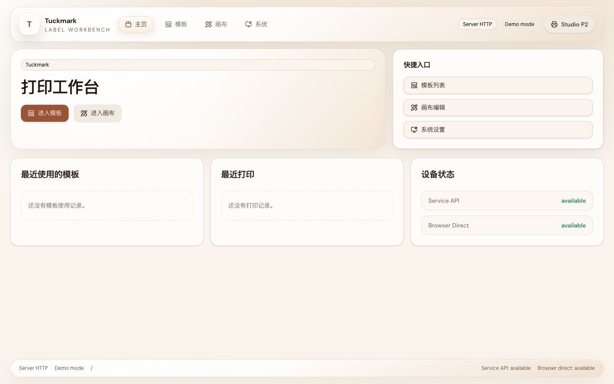

- `1100×820` template workspace in narrow single-outlet mode with a disabled preview/print rail before template selection

  PR: include
  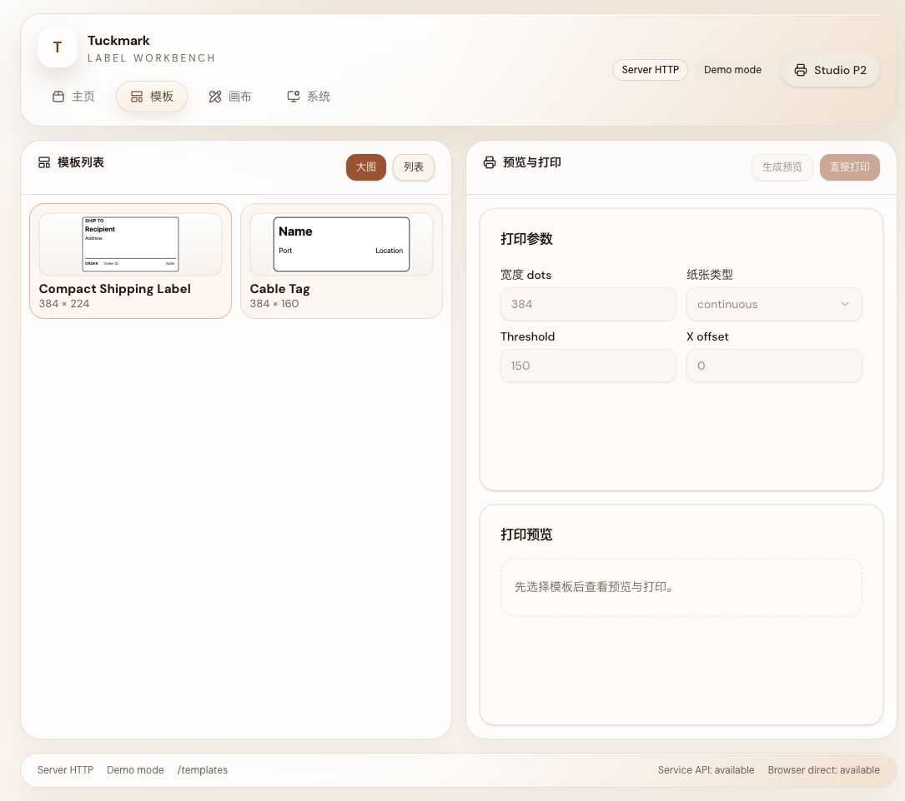

- `1440×900` template large-card grid keeps same-row cards equal height and exposes add-template entry points in both the list header and empty user-template group

  PR: include
  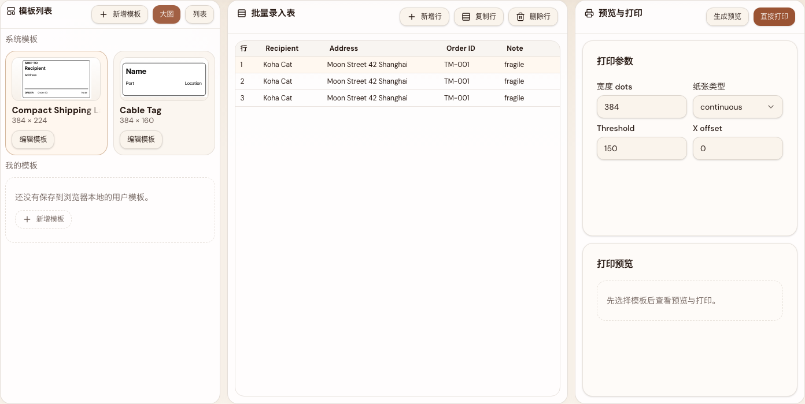

- `1280×800` canvas workspace in professional three-column editor mode

  PR: include
  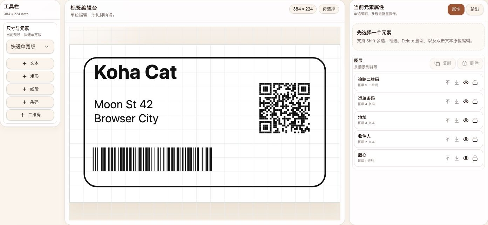

- `1100×820` canvas workspace in narrow desktop single-side mode with stage always visible

  PR: include
  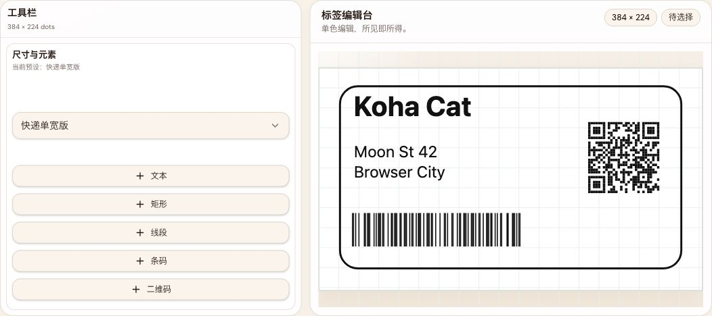

- `1280×800` canvas workspace with real barcode selection and inspector editing state

  PR: include
  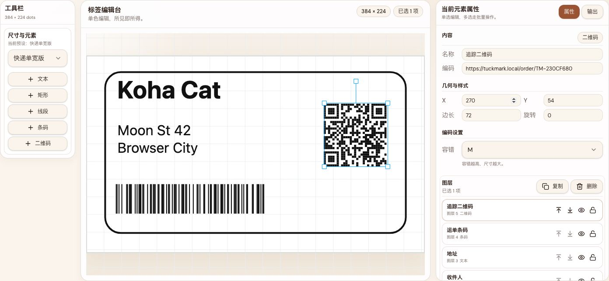

- `1280×800` canvas workspace output rail after preview generation, with stage and preview sharing the same monochrome content semantics

  PR: include
  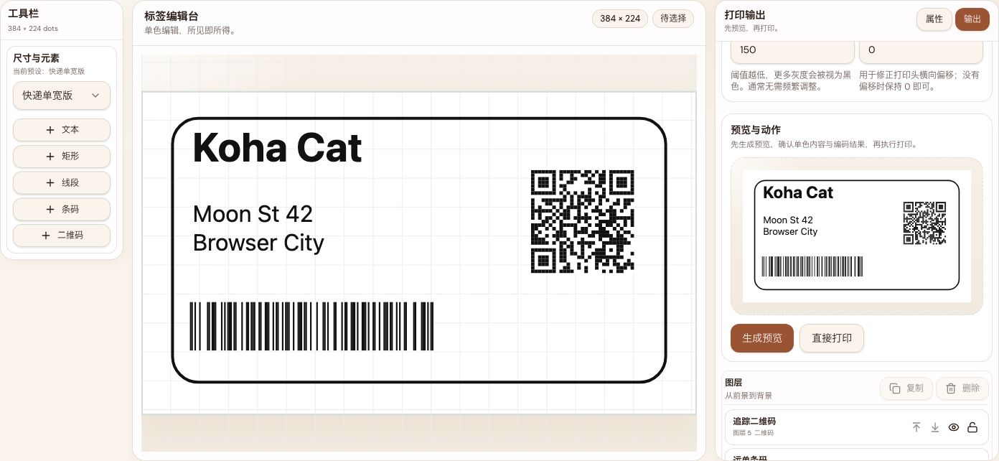

- `1280×800` template workspace showing grouped `系统模板 / 我的模板` cards with a browser-local user template present

- `1440×900` homepage shell with non-selectable shared chrome and selectable status/value fields preserved where copying matters

  PR: include
  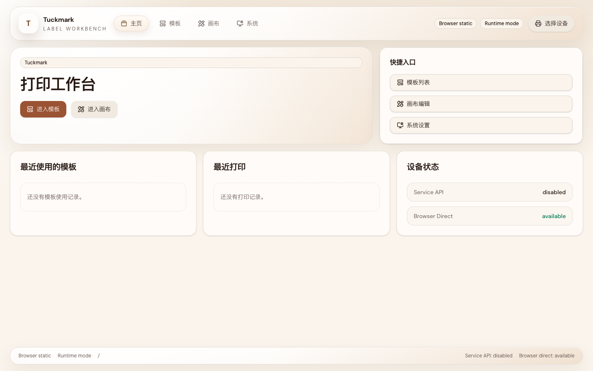

- `1280×800` template workspace with non-selectable list/table chrome and selectable inline editing field behavior

  PR: include
  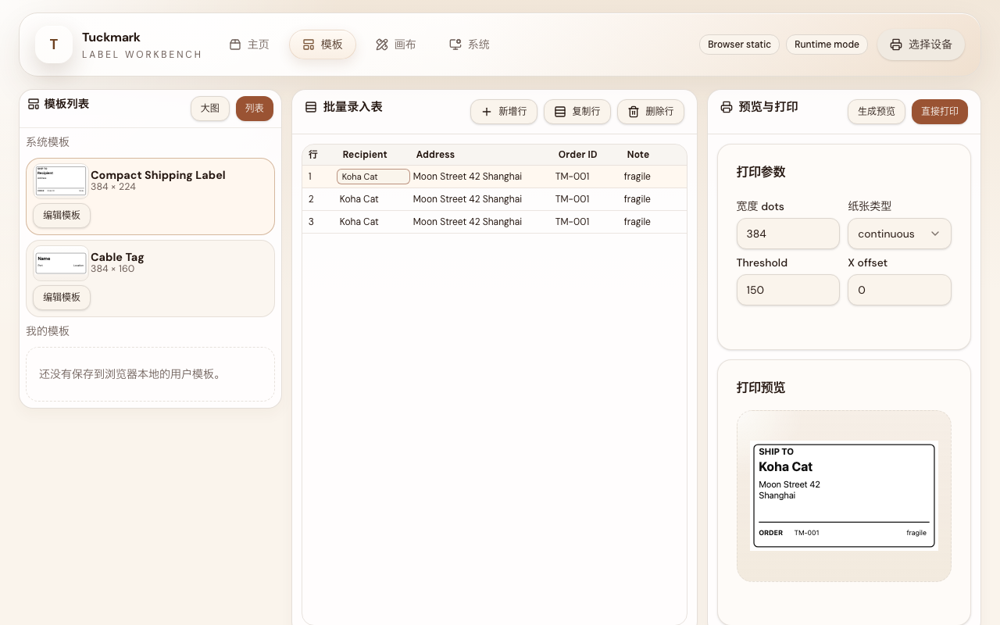

- `1280×800` canvas workspace default state with non-selectable toolbar/stage chrome and selectable read-only metadata fields

  PR: include
  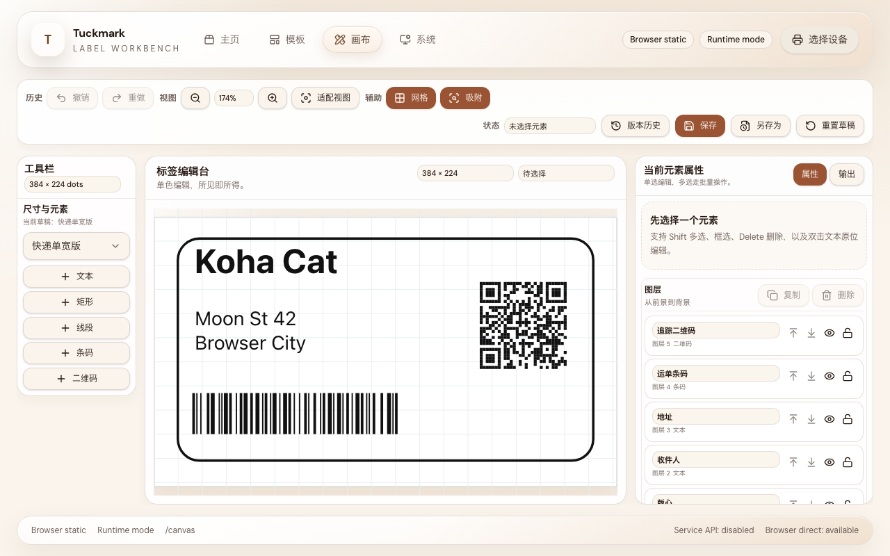

- `1280×800` canvas workspace text-selected state with selectable property editor fields preserved inside the hardened chrome contract

  PR: include
  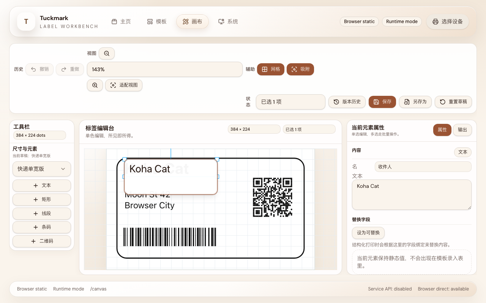

  PR: include
  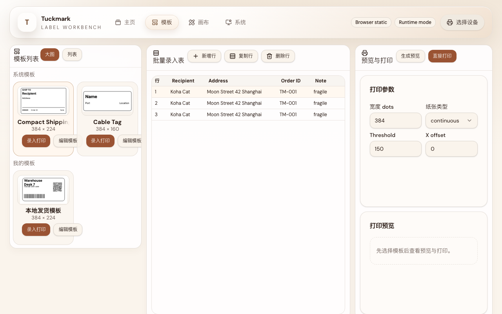

- `1280×800` canvas workspace on a browser-local user template with the version-history drawer open and saved/autosave history visible

  PR: include
  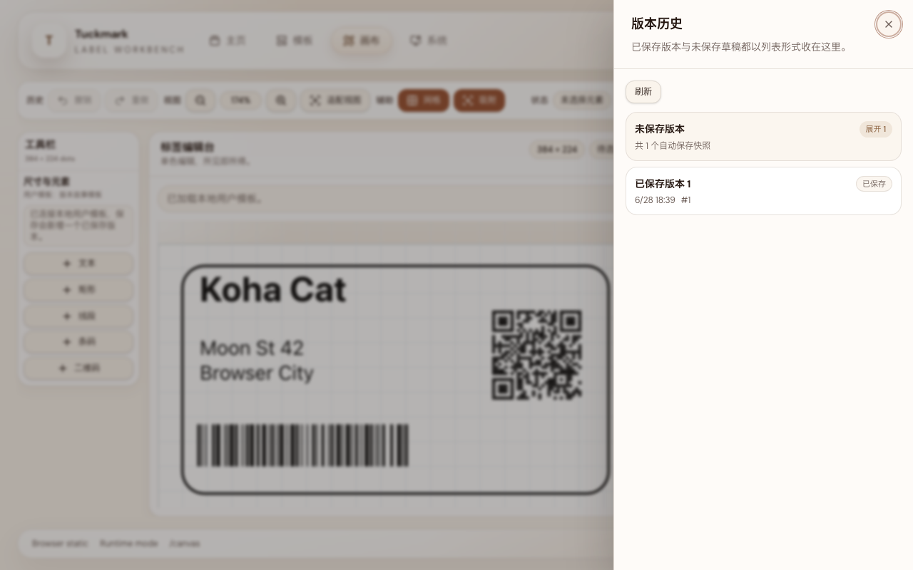

- `1600×1024` system page in wide three-column mode

  PR: include
  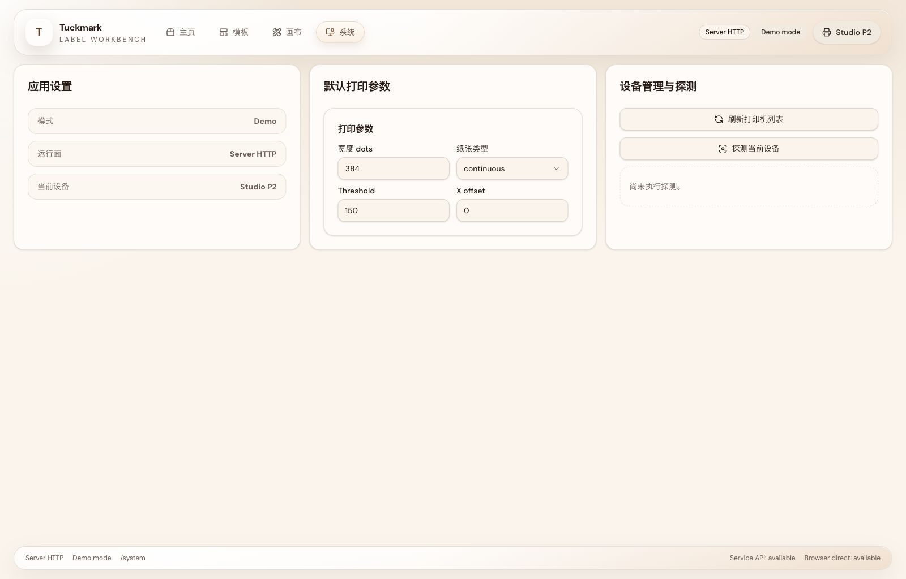
