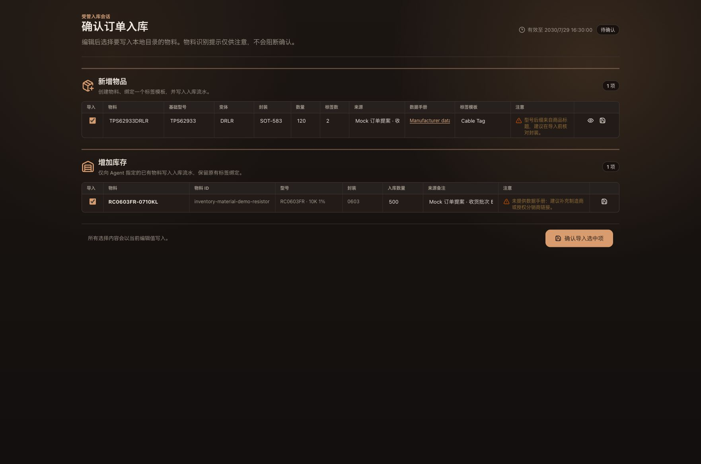

# Tuckmark Agent-Assisted Inventory Intake

## Background

External agents can interpret private order exports and product pages, while Tuckmark must remain a deterministic inventory, label, and confirmation system. The product must never ingest an original order file, invoke an LLM, or automate a browser as part of this capability.

## Scope

- Define the `tuckmark.agent-import.v1` proposal contract for agent-produced new-material and restock entries.
- Let a DEVD `server-http` instance own the configured local data directory, short-lived import sessions, field-completion events, and confirmed inventory writes.
- Make CLI commands exchange proposal, catalog, inventory, and event data with DEVD.
- Provide a confirmation route with two editable tables: **new items** and **restock existing inventory**.
- Publish released and source-tree Agent Skills that describe order interpretation, identity decisions, datasheet links, and CLI interaction.

## Non-goals

- Tuckmark does not parse Taobao exports, host an LLM, crawl product pages, or store original order content.
- Datasheet PDFs are not uploaded or mirrored. A material stores a manufacturer or authorized-distributor URL, or a reason that no trustworthy URL was found.
- `browser-static` does not support managed agent import sessions.

## Contracts

### Proposal

`tuckmark.agent-import.v1` contains Agent-selected items. Each item is either:

- `new`: a proposed material, a positive inbound quantity, a positive label print quantity, one selected label template, Agent-ranked alternatives, initial field values, optional datasheets, and an optional non-blocking `needsAttention` message.
- `restock`: an Agent-selected stable `targetMaterialId`, a positive inbound quantity, and an optional non-blocking `needsAttention` message. It retains its existing material and label binding rather than receiving a recommendation.

The Agent decides material identity. It may set `needsAttention` when it is uncertain; neither the CLI nor confirmation page forces a separate identity confirmation.

The Agent derives label print quantity from storage packages or independently labeled units rather than copying the inventory quantity. The confirmation table exposes it as an independently editable value and DEVD persists it on the created label binding. Older proposals without the field remain compatible and default to one.

### Template Catalog

Catalog records expose `recommendedUses[]`, each with a human-readable scope and integer weight. New material recommendations are Agent-authored and ordered by the Agent. A template with an empty scope list remains usable but is not a default recommendation. DEVD catalog responses contain system templates and templates in the shared data directory only. In `server-http`, browser-local templates are not read as a fallback and are not migrated automatically.

### Session Authorization and Lifetime

The CLI creates a high-entropy session identifier and secret. The confirmation URL includes only the secret in its fragment. Every session request presents both values, with the secret in an HTTP header. Sessions, including completed or cancelled sessions, expire and are removed after 30 minutes.

### Template Completion

When the user changes a new material template, DEVD creates a `template-input-requested` event containing the selected template field contract and the item revision. The page freezes only that template panel while it awaits the Agent. The Agent uses the CLI to fulfill the event. A response with an older revision is rejected and never overwrites user edits.

Template changes use DEVD catalog records and create field-completion events. Browser-local template snapshots are not imported implicitly; moving browser data into DEVD requires an explicit archive import decision.

### Confirmed Writes

Confirmation writes are server-owned and recoverable. Selected new items create one material, one label binding, and one inbound adjustment. Selected restocks create only an inbound adjustment for an active existing material. The service serializes commits, accumulates repeated restocks against the latest in-transaction quantity, retains the global matrix-code uniqueness invariant, and refreshes the shared directory manifest. Missing targets, archived targets, conflicts, or concurrent changes abort the transaction without partial visible writes.

### DEVD Data Ownership

In `server-http`, DEVD is the sole owner of templates, versions, working copies, application settings, inventory, backups, and archive imports. The Web app uses resource command endpoints with a persisted global revision; every mutation supplies `expectedRevision`, and stale writes receive `409 revision_conflict`. SSE events contain only the revision, affected domains, and reason, allowing open Web clients to invalidate and refetch without exposing business data, paths, session keys, or import contents.

Starting DEVD claims its configured directory with a durable ownership marker and one live PID-scoped lock before serving mutations. A surviving live owner is rejected, while a lock from a dead process is recovered safely. Client resource commands serialize local mutations so each request carries the revision returned by its predecessor. CLI write commands refuse a directory selected by `TUCKMARK_DATA_DIR` or already claimed by DEVD, so they cannot create an unrevisioned side channel. DEVD data and Agent Import routes accept only requests whose connected peer is loopback; `Host` and `Origin` headers never establish local trust for a non-loopback client.

`browser-static` retains browser-local persistence. It is not a fallback for `server-http`, does not request a directory on behalf of DEVD, and is never migrated automatically.

Archive imports are explicitly selected as `merge` or `replace`. Archive validation rejects duplicate records and broken references: a template must name one of its versions, versions and user-template working copies must target a contained template, user-template inventory bindings must target a contained template, and adjustments must target a contained material. Merge accepts only complete, purely new template and inventory aggregates and preserves current settings; any identifier, material name, matrix code, version, working-copy, or adjustment conflict rejects the entire transaction. Replace creates a protection backup and atomically replaces the managed data set. Both modes revalidate the inspected content hash and expected revision at commit time.

## Acceptance Criteria

- CLI catalog and inventory commands read DEVD data; `--devd-url` wins over `TUCKMARK_DEVD_URL` and either omission fails.
- The create command opens an authorized confirmation URL unless `--no-open` is supplied. Its Web origin is independently selectable with `--web-url` / `TUCKMARK_WEB_URL`; local development derives the paired Web port from the configured server and Web ports when no origin is supplied.
- The page presents separate editable tables for new-material and restock records. Table cells display their value by default and enter an editor only after the user clicks that cell; `Enter` or blur returns to display mode, while `Escape` restores the value present before editing began. New-material supplementary fields, label preview, and template fields expand in a detail row. It supports non-blocking attention/datasheet warnings and selection. Restock controls edit only the persisted intake values (selection, quantity, and source note); target material details stay visible and read-only because confirmation writes only its inbound adjustment.
- Template switches produce an Agent event, wait state, and fresh field preview after fulfillment.
- Tests use mocked order-derived proposals only. No real order file, session secret, product body, or screenshot is committed.
- `/system` reports the DEVD directory basename, health, revision, SSE state, and exact managed counts without directory authorization or cross-tab lease controls.

## Visual Evidence

Mock-only Storybook confirmation route, covering both **new items** and **restock existing inventory**. The restock row resolves its read-only material identity from DEVD rather than the Agent proposal; display-first table cells still enter editing on click, and the page retains its non-blocking identity and missing-datasheet warnings. `source_type=storybook_canvas`; `target_program=mock-only`; `capture_scope=browser-viewport`; `sensitive_exclusion=real orders, data directories, session keys, and unrelated applications`; `submission_gate=approved`.

PR: include

PR: include

Mock fixture system page after DEVD became the `server-http` data owner. `source_type=mock_ui`; `target_program=mock-only`; `capture_scope=browser-viewport`; `sensitive_exclusion=real orders, data directories, session keys, and unrelated applications`; `submission_gate=approved`.

PR: include

Mock-only icon action after the 520 ms touch long-press interaction. `source_type=storybook_canvas`; `target_program=mock-only`; `capture_scope=element`; `sensitive_exclusion=N/A`; `submission_gate=approved`.

PR: include

