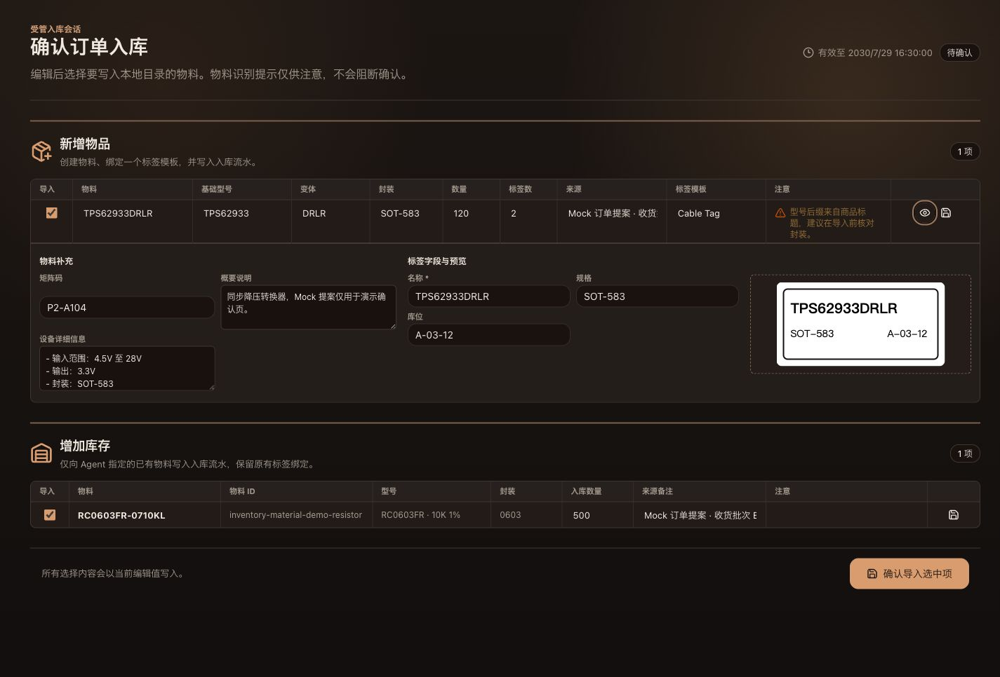
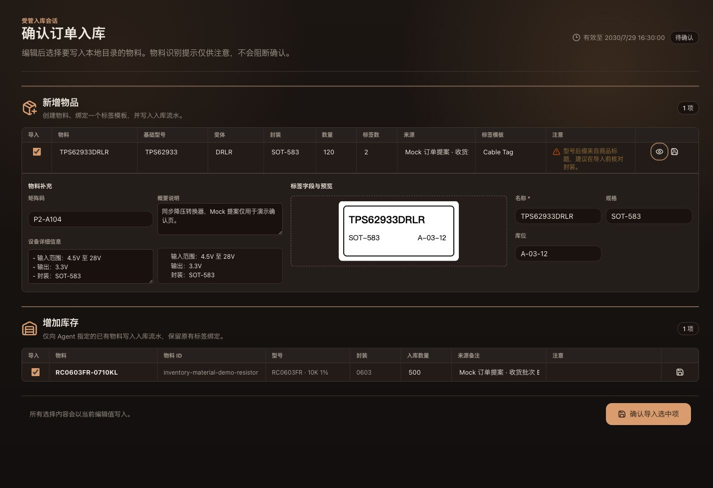
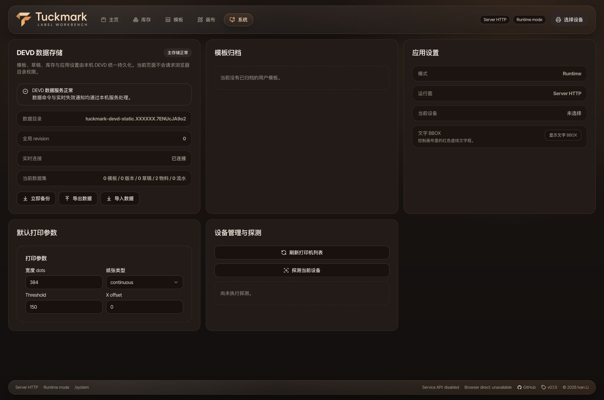
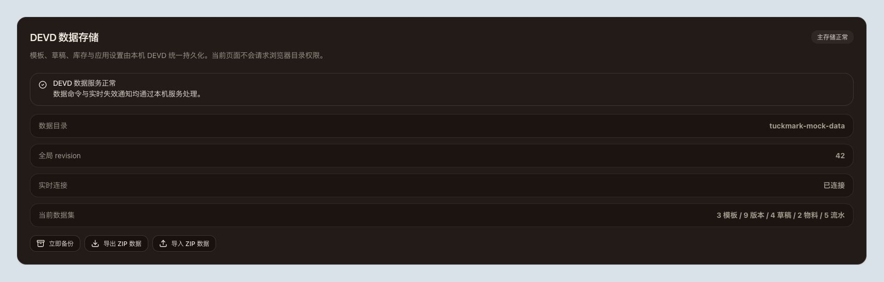
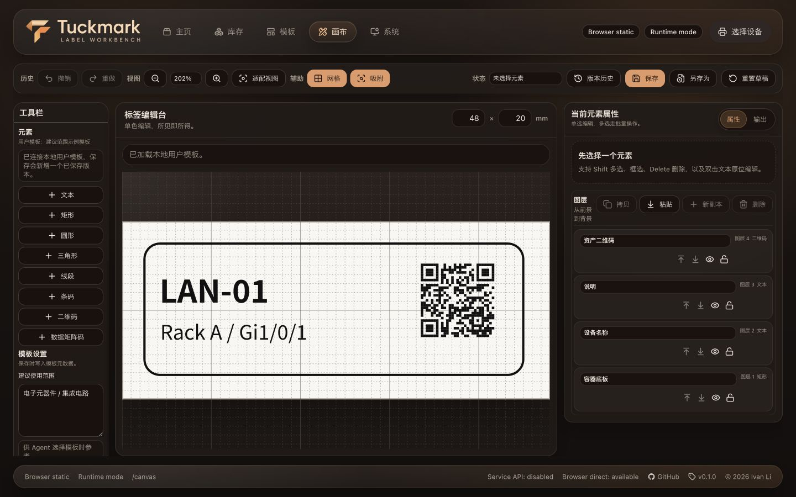

# Tuckmark Agent-Assisted Inventory Intake

## Background

External agents can interpret private order exports and product pages, while Tuckmark must remain a deterministic inventory, label, and confirmation system. The product must never ingest an original order file, invoke an LLM, or automate a browser as part of this capability.

## Scope

- Define the `tuckmark.agent-import.v1` proposal contract for agent-produced new-material and restock entries.
- Let a DEVD `server-http` instance own the configured local data directory, short-lived import sessions, field-completion events, and confirmed inventory writes.
- Make CLI commands exchange proposal, catalog, inventory, and event data with DEVD.
- Provide a confirmation route with two editable tables: **new items** and **restock existing inventory**.
- Publish released and source-tree Agent Skills that describe order interpretation, identity decisions, and CLI interaction.

## Non-goals

- Tuckmark does not parse Taobao exports, host an LLM, crawl product pages, or store original order content.
- `browser-static` does not support managed agent import sessions.

## Contracts

### Proposal

`tuckmark.agent-import.v1` contains Agent-selected items. Each item is either:

- `new`: a proposed material, a positive inbound quantity, a positive label print quantity, one selected label template, Agent-ranked alternatives, initial field values, and an optional non-blocking `needsAttention` message.
- `restock`: an Agent-selected stable `targetMaterialId`, a positive inbound quantity, and an optional non-blocking `needsAttention` message. It retains its existing material and label binding rather than receiving a recommendation.

The Agent decides material identity. It may set `needsAttention` when it is uncertain; neither the CLI nor confirmation page forces a separate identity confirmation.

The Agent derives label print quantity from storage packages or independently labeled units rather than copying the inventory quantity. The confirmation table exposes it as an independently editable value and DEVD persists it on the created label binding. Older proposals without the field remain compatible and default to one.

Each proposed material uses `description` as a concise overview and `deviceDetails` as one Markdown-capable string for factual device details. It is not a nested attribute structure and Tuckmark does not infer additional fields from it. The confirmation workspace edits the source string without adding a duplicate inline rendering; inventory read surfaces may render the same string without raw HTML; confirmed new-material writes retain the same string. Older material records and proposals read with an empty `deviceDetails` value.

### Template Catalog

Catalog records expose an optional `recommendedUse` human-readable suggested-usage string. It describes where a template is suitable; it is neither a collection nor a score. New material recommendations are Agent-authored and ordered from the material evidence, without a template weight or score. A template without this suggestion remains usable but is not a default recommendation. The Canvas workspace edits this one template-metadata string in a compact multiline text field so a sentence can wrap naturally; line breaks remain part of the same value and never imply multiple suggestions. The batch-entry table remains limited to variable data. Existing persisted `recommendedUses[]` values are accepted only when reading older local data and are combined in source order into `recommendedUse`; all new writes and API responses use the singular field. A present empty `recommendedUse` explicitly clears the metadata, while an omitted field preserves the existing value so unchanged legacy drafts cannot erase it. DEVD catalog responses contain system templates and templates in the shared data directory only. In `server-http`, browser-local templates are not read as a fallback and are not migrated automatically.

### Session Authorization and Lifetime

The CLI creates a high-entropy session identifier and secret. The confirmation URL includes only the secret in its fragment. Every session request presents both values, with the secret in an HTTP header. Sessions, including completed or cancelled sessions, expire and are removed after 30 minutes.

### Template Completion

When the user changes a new material template, DEVD creates a `template-input-requested` event containing the selected template field contract and the item revision. The page freezes only that template panel while it awaits the Agent. The Agent uses the CLI to fulfill the event. A response with an older revision is rejected and never overwrites user edits.

Template changes use DEVD catalog records and create field-completion events. Browser-local template snapshots are not imported implicitly; moving browser data into DEVD requires an explicit archive import decision.

### Confirmed Writes

Confirmation writes are server-owned and recoverable. Selected new items create one material, one label binding, and one inbound adjustment. Selected restocks create only an inbound adjustment for an active existing material. The service serializes commits, accumulates repeated restocks against the latest in-transaction quantity, retains the global matrix-code uniqueness invariant, and refreshes the shared directory manifest. Missing targets, archived targets, conflicts, or concurrent changes abort the transaction without partial visible writes.

After a successful confirmation, the Web page leaves the expiring session route and replaces it with the active Web base path's `/inventory` route so the user can inspect the committed materials and inventory adjustments immediately. Failed confirmations remain on the confirmation page with an error.

### DEVD Data Ownership

In `server-http`, DEVD is the sole owner of templates, versions, working copies, application settings, inventory, backups, and archive imports. The Web app uses resource command endpoints with a persisted global revision; every mutation supplies `expectedRevision`, and stale writes receive `409 revision_conflict`. SSE events contain only the revision, affected domains, and reason, allowing open Web clients to invalidate and refetch without exposing business data, paths, session keys, or import contents.

Starting DEVD claims its configured directory with a durable ownership marker and one live PID-scoped lock before serving mutations. A surviving live owner is rejected, while a lock from a dead process is recovered safely. Client resource commands serialize local mutations so each request carries the revision returned by its predecessor. CLI write commands refuse a directory selected by `TUCKMARK_DATA_DIR` or already claimed by DEVD, so they cannot create an unrevisioned side channel. DEVD data and Agent Import routes accept only requests whose connected peer is loopback; `Host` and `Origin` headers never establish local trust for a non-loopback client.

`browser-static` retains browser-local persistence. It is not a fallback for `server-http`, does not request a directory on behalf of DEVD, and is never migrated automatically.

Recent templates and prints remain browser-local presentation metadata in both Web surfaces. They are never used as a fallback for DEVD-owned records, do not call the legacy `/api/sync` endpoint, and do not enter DEVD archives or backups.

Archive imports are explicitly selected as `merge` or `replace`. Archive validation rejects duplicate records and broken references: a template must name one of its versions, versions and user-template working copies must target a contained template, user-template inventory bindings must target a contained template, and adjustments must target a contained material. Merge accepts only complete, purely new template and inventory aggregates and preserves current settings; any identifier, material name, matrix code, version, working-copy, or adjustment conflict rejects the entire transaction. Replace creates a protection backup and atomically replaces the managed data set. Both modes revalidate the inspected content hash and expected revision at commit time.

User-facing export writes the established `tuckmark.runtime-export-archive.v1` ZIP file tree in both Web surfaces. `archive.json` contains only export metadata; `manifest.json` records exact counts; settings, templates, versions, all working-copy kinds, material records including bindings and device-detail Markdown, and adjustments each have their own JSON entry. Import rejects a missing settings entry or a mismatch between manifest counts and extracted records, so a truncated archive cannot silently restore as incomplete data. Previously generated `tuckmark.data-archive.v1` single-snapshot ZIP files remain a read-compatible input. Backups include all durable user data, including archived records; they intentionally exclude DEVD locks, recoverable transaction journals, ownership metadata, and expiring Agent Import sessions or credentials.

## Acceptance Criteria

- CLI catalog and inventory commands read DEVD data; `--devd-url` wins over `TUCKMARK_DEVD_URL` and either omission fails.
- The create command opens an authorized confirmation URL unless `--no-open` is supplied. Its Web origin is independently selectable with `--web-url` / `TUCKMARK_WEB_URL`; local development derives the paired Web port from the configured server and Web ports when no origin is supplied.
- The page presents separate editable tables for new-material and restock records. Table cells display their value by default and enter an editor only after the user clicks that cell; `Enter` or blur returns to display mode, while `Escape` restores the value present before editing began. New-material supplementary fields, label preview, and template fields expand in a detail row. It supports non-blocking attention and selection. Restock controls edit only the persisted intake values (selection, quantity, and source note); target material details stay visible and read-only because confirmation writes only its inbound adjustment.
- The material overview remains a concise `description`; device detail is an independently editable Markdown string. Read-only inventory surfaces render it safely, while the confirmation workspace keeps the source input single and avoids duplicating the rendered text. The white label itself is visually distinct from its non-white preview work area.
- Template switches produce an Agent event, wait state, and fresh field preview after fulfillment. Label previews render the authoritative template: system templates use their built-in definition, while shared user templates use the current DEVD working copy with the saved version as fallback. The confirmation page must not substitute a template name or concatenated field values for the rendered label.
- Tests use mocked order-derived proposals only. No real order file, session secret, product body, or screenshot is committed.
- `/system` reports the DEVD directory basename, health, revision, SSE state, and exact managed counts without directory authorization or cross-tab lease controls.

## Visual Evidence

Mock-only Storybook confirmation preview after adding the Markdown `deviceDetails` material string. The form keeps a concise `description` as the overview, edits the Markdown-capable source without duplicating it below the textarea, has no datasheet column or metadata field, and places the white physical label inside a dark preview workspace so its boundary is visible. `source_type=storybook_canvas`; `target_program=mock-only`; `capture_scope=element`; `requested_viewport=none`; `viewport_strategy=storybook-viewport`; `margin_policy=trim_only`; `evidence_surface=page`; `sensitive_exclusion=real orders, data directories, session keys, real templates, and unrelated applications`; `submission_gate=pending-owner-approval`; `story_id_or_title=Tuckmark/Agent Import/Confirmation Page/Ready To Confirm`; `state=label preview expanded`; `evidence_note=verifies the Markdown source input and the separate dark label-preview workspace.`

PR: include

Mock-only Storybook confirmation preview after tightening the expanded detail panel. The empty third detail column is removed; material overview and Markdown device details share a compact two-column layout, while the template preview and editable fields keep their own two-column workspace. `source_type=storybook_canvas`; `target_program=mock-only`; `capture_scope=browser-viewport`; `requested_viewport=1440x900`; `viewport_strategy=browser-resize-fallback`; `margin_policy=trim_only`; `evidence_surface=page`; `sensitive_exclusion=real orders, data directories, session keys, real templates, and unrelated applications`; `submission_gate=pending-owner-approval`; `story_id_or_title=Tuckmark/Agent Import/Confirmation Page/Ready To Confirm`; `state=label preview expanded`; `evidence_note=verifies compact two-column detail layout without a blank third grid column or an unnecessarily tall stacked text area.`

PR: include

Mock-only Storybook confirmation preview with the physical label preview anchored at the far right of the template detail area. Template fields stay in the middle column so the editable values and the rendered label have a clear left-to-right separation. `source_type=storybook_canvas`; `target_program=mock-only`; `capture_scope=browser-viewport`; `requested_viewport=1440x900`; `viewport_strategy=browser-resize-fallback`; `margin_policy=trim_only`; `evidence_surface=page`; `sensitive_exclusion=real orders, data directories, session keys, real templates, and unrelated applications`; `submission_gate=pending-owner-approval`; `story_id_or_title=Tuckmark/Agent Import/Confirmation Page/Ready To Confirm`; `state=label preview expanded`; `evidence_note=verifies the preview is the rightmost visual element in the detail panel while 1023px stays paired and narrow layouts stack.`

PR: include

Mock fixture system page after DEVD became the `server-http` data owner. `source_type=mock_ui`; `target_program=mock-only`; `capture_scope=browser-viewport`; `sensitive_exclusion=real orders, data directories, session keys, and unrelated applications`; `submission_gate=approved`.

PR: include

Mock-only DEVD data-storage fragment confirming that the backup, ZIP export, and ZIP import actions use the workbench-standard action-button language with unambiguous archive, download, and upload icons. `source_type=storybook_canvas`; `target_program=mock-only`; `capture_scope=element`; `requested_viewport=none`; `viewport_strategy=storybook-viewport`; `margin_policy=require_margin`; `evidence_surface=component`; `sensitive_exclusion=real orders, data directories, session keys, and unrelated applications`; `submission_gate=approved`; `story_id_or_title=Tuckmark/System/Data Storage Card/Devd Healthy`; `state=healthy`; `evidence_note=DEVD data maintenance actions retain the shared ZIP contract without browser directory controls`.

PR: include

Mock-only icon action after the 520 ms touch long-press interaction. `source_type=storybook_canvas`; `target_program=mock-only`; `capture_scope=element`; `sensitive_exclusion=N/A`; `submission_gate=approved`.

PR: include

Mock-only Canvas template-settings field, confirming that one suggested-use sentence is edited in a multiline text field and stays outside the batch-entry table. The side panes retain content-driven heights instead of being forced to share the center workspace's bottom edge. The inspector body keeps a 12 px right and bottom inset aligned with its header. `source_type=storybook_canvas`; `target_program=mock-only`; `capture_scope=browser-viewport`; `requested_viewport=canvas-desktop-editor (1440x900)`; `viewport_strategy=storybook-viewport`; `margin_policy=trim_only`; `evidence_surface=page`; `sensitive_exclusion=real templates, data directories, session keys, and unrelated applications`; `submission_gate=pending-owner-approval`; `story_id_or_title=Tuckmark/Workbench/Canvas Workspace Template Suggested Use`; `state=configured`.

